# WebSocket Protocol Documentation

This document describes the matplotlib-fastapi WebSocket protocol for interactive plotting.

## Table of Contents

1. [Initial Connection Flow](#initial-connection-flow)
2. [Client-Initiated Messages](#client-initiated-messages)
3. [Server-Initiated Messages](#server-initiated-messages)
4. [Idle Draw Cycle](#idle-draw-cycle)

---

## Initial Connection Flow

The initial connection establishes the WebSocket, validates the protocol, and sends configuration to the client.

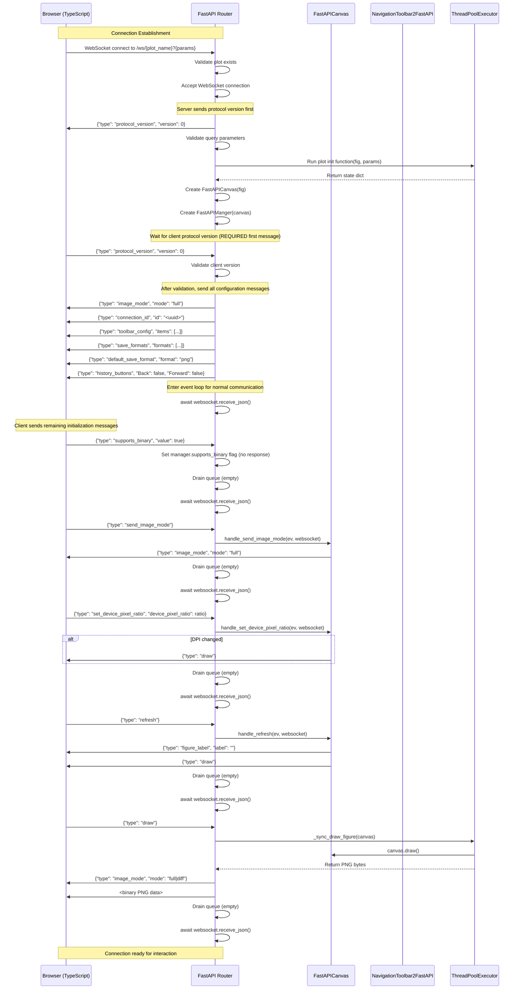

### Key Points

1. **Protocol handshake is required**: 
   - Server sends `protocol_version` (version 0) immediately after accepting connection
   - Client MUST send `protocol_version` as its first message
   - Server validates version compatibility before sending any other messages
   - If incompatible, server sends error and closes connection (code 1008)

2. **Server sends 6 configuration messages** after protocol validation:
   - `image_mode` (full or diff)
   - `connection_id` (UUID for downloads)
   - `toolbar_config` (button definitions)
   - `save_formats` (available save formats)
   - `default_save_format` (default format)
   - `history_buttons` (initial toolbar state)

3. **Initialization is deterministic**: The toolbar's `set_history_buttons()` is deferred during `__init__` to prevent race conditions. After protocol validation, the server sends all configuration including history_buttons.

4. **Client sends remaining initialization messages** after handshake:
   - `supports_binary` - declares binary WebSocket support
   - `send_image_mode` - requests current image mode
   - `set_device_pixel_ratio` - sets device pixel ratio (if not 1.0)
   - `refresh` - requests initial draw
   - `draw` - triggers first image render

5. **Queue draining**: After handling each client message (except `draw` which handles responses inline), the router calls `canvas.drain_queue()` which sends all queued messages. Toolbar actions (pan, zoom, navigate) will queue messages that are sent at this point.

---

## Client-Initiated Messages

### Mouse Events

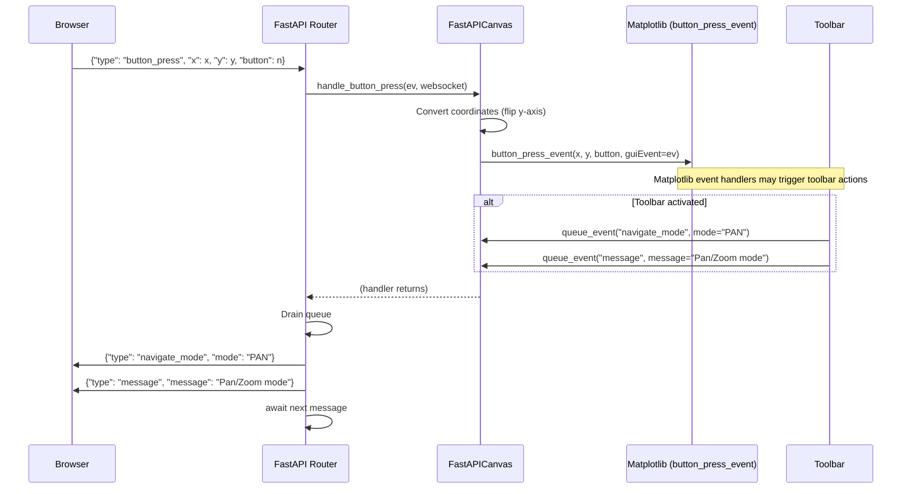

**Mouse event types:**
- `button_press` - Mouse button pressed
- `button_release` - Mouse button released
- `motion_notify` - Mouse moved
- `dblclick` - Double-click
- `scroll` - Mouse wheel scrolled
- `figure_enter` - Mouse entered figure
- `figure_leave` - Mouse left figure

**Response:** Queued messages (if any) from event handlers + toolbar

---

### Keyboard Events

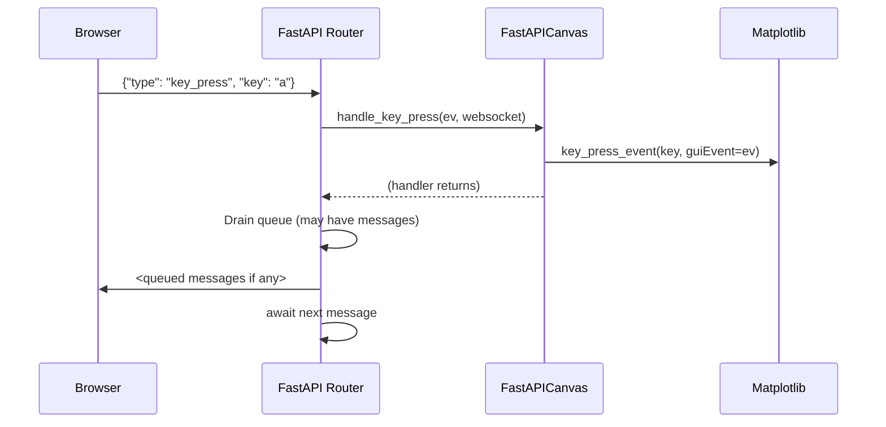

**Keyboard event types:**
- `key_press` - Key pressed
- `key_release` - Key released

**Response:** Queued messages (if any) from event handlers

---

### Resize

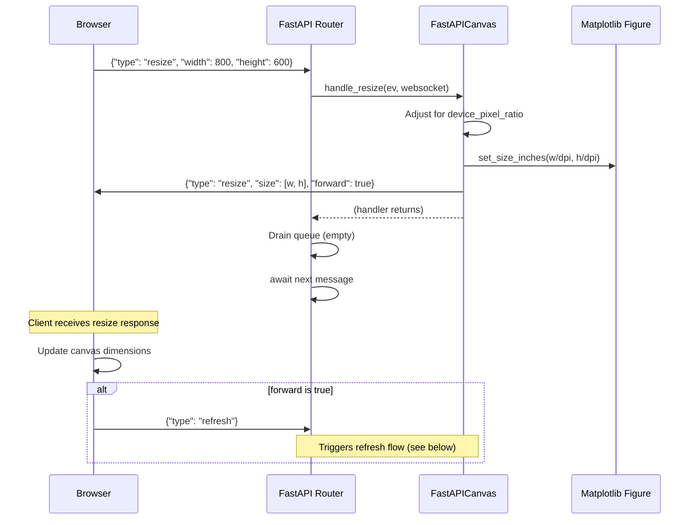

**Request:**
```json
{"type": "resize", "width": 800, "height": 600}
```

**Response:** Direct send from handler
```json
{"type": "resize", "size": [800, 600], "forward": true}
```

---

### Set Device Pixel Ratio

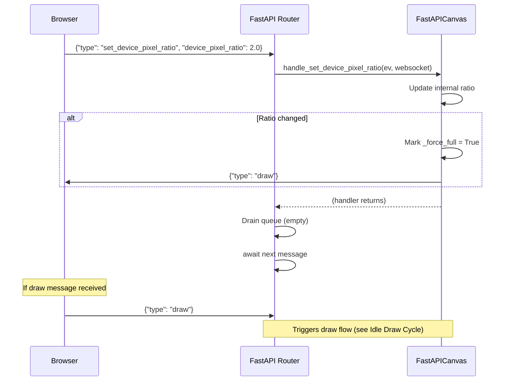

**Request:**
```json
{"type": "set_device_pixel_ratio", "device_pixel_ratio": 2.0}
```

**Response:** Direct send (only if ratio changed)
```json
{"type": "draw"}
```

---

### Refresh

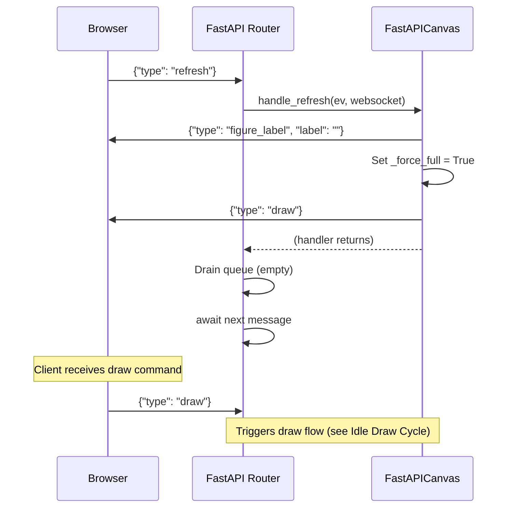

**Request:**
```json
{"type": "refresh"}
```

**Response:** Direct sends from handler
```json
{"type": "figure_label", "label": "Figure Title"}
{"type": "draw"}
```

---

### Toolbar Button

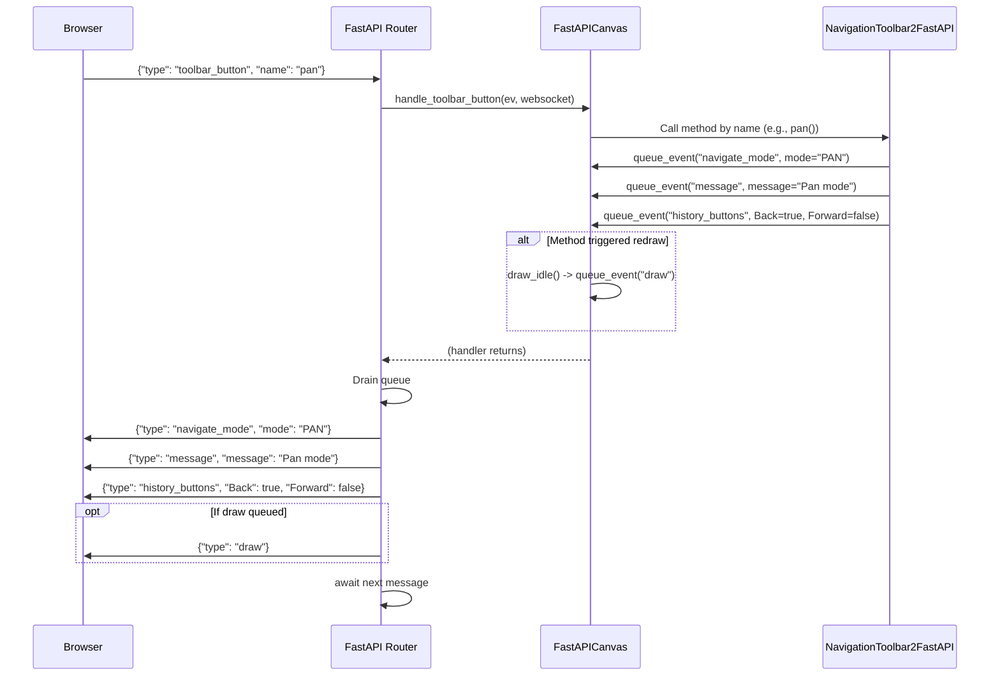

**Common toolbar buttons:**
- `home` - Reset to original view
- `back` - Navigate back in view history
- `forward` - Navigate forward in view history
- `pan` - Activate pan/zoom mode
- `zoom` - Activate zoom mode

**Response:** Queued messages from toolbar (varies by button)

---

### Update Parameters

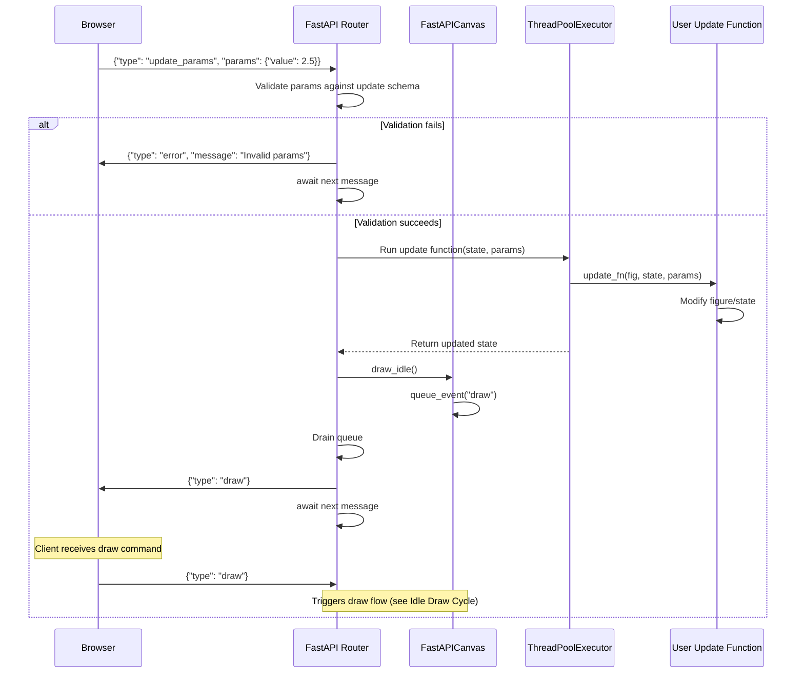

**Request:**
```json
{"type": "update_params", "params": {"value": 2.5, "color": "red"}}
```

**Response:** Queued draw message
```json
{"type": "draw"}
```

---

### Save Figure

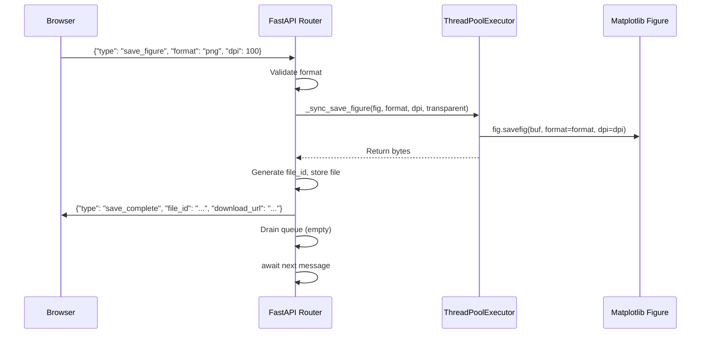

**Request:**
```json
{
  "type": "save_figure",
  "format": "png",
  "dpi": 100,
  "transparent": false
}
```

**Response:** Direct send
```json
{
  "type": "save_complete",
  "file_id": "abc123",
  "download_url": "/plots/download/abc123",
  "filename": "figure.png",
  "format": "png"
}
```

---

## Server-Initiated Messages

The server can send messages at any time, typically in response to canvas events or toolbar actions.

### Message Types

| Type | Trigger | Content |
|------|---------|---------|
| `draw` | Canvas needs redraw | `{"type": "draw"}` |
| `image_mode` | Before sending image | `{"type": "image_mode", "mode": "full"\|"diff"}` |
| `figure_label` | Figure title changed | `{"type": "figure_label", "label": "Title"}` |
| `message` | Toolbar displays message | `{"type": "message", "message": "Text"}` |
| `navigate_mode` | Pan/zoom mode changed | `{"type": "navigate_mode", "mode": "PAN"\|"ZOOM"\|"NONE"}` |
| `history_buttons` | Nav stack changed | `{"type": "history_buttons", "Back": bool, "Forward": bool}` |
| `rubberband` | Selection in progress | `{"type": "rubberband", "x0": n, "y0": n, "x1": n, "y1": n}` |
| `save` | Toolbar save button | `{"type": "save"}` (triggers client save flow) |

---

## Idle Draw Cycle

The idle draw cycle is how matplotlib figures are rendered and sent to the browser.

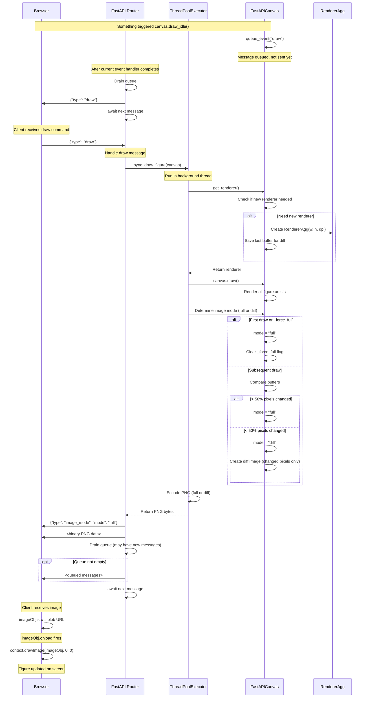

### Key Points

1. **Asynchronous queueing**: `draw_idle()` doesn't immediately send a message, it queues one. The queue is drained after the current event handler completes.

2. **Thread pool execution**: The actual drawing happens in a background thread to avoid blocking the event loop.

3. **Differential rendering**: After the first draw, the backend compares the current buffer with the previous one. If < 50% of pixels changed, it sends only the diff.

4. **Full vs Diff mode**:
   - **Full**: Entire PNG image
   - **Diff**: PNG with transparent background, only changed pixels visible

5. **Binary WebSocket**: Images are sent as binary WebSocket frames, not JSON.

6. **Client rendering**: The browser uses an `` element to decode the PNG, then draws it to a `<canvas>` using `drawImage()`.

---

## Protocol Version Negotiation

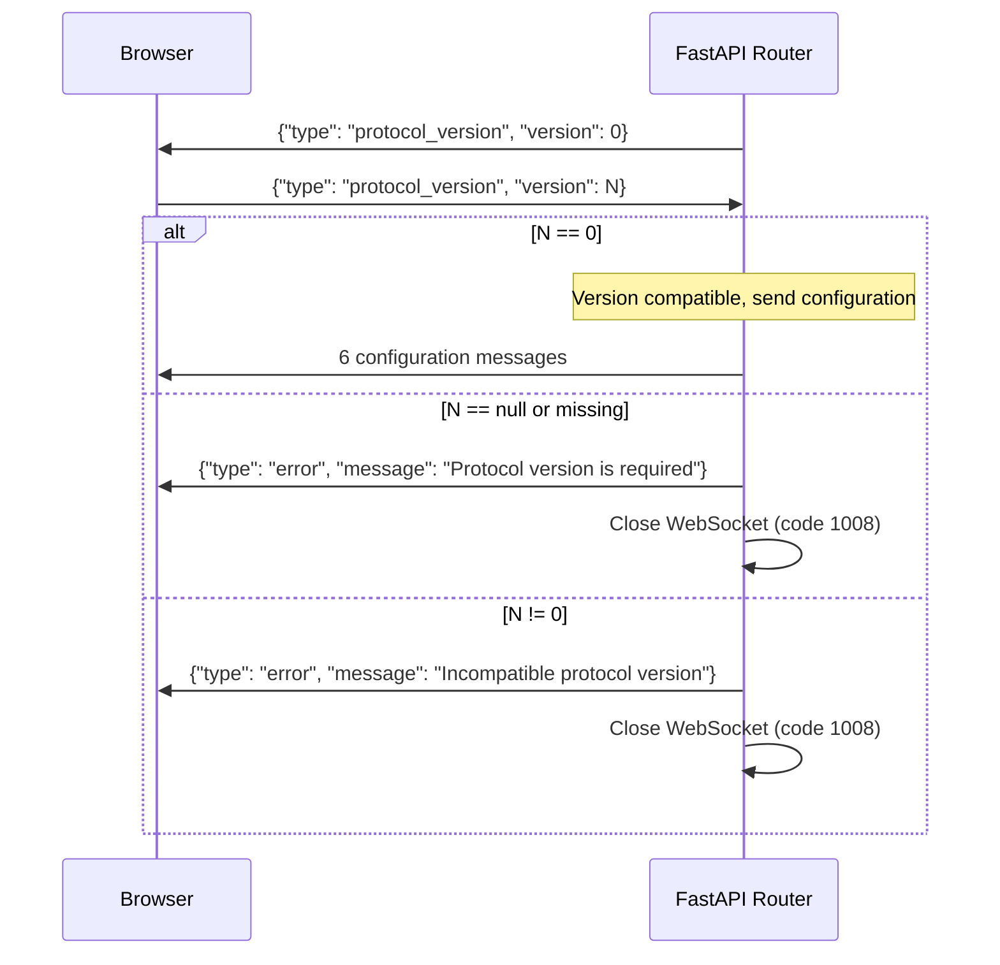

**Protocol version is REQUIRED**: Both client and server must send the version field. The client's protocol_version message MUST be the first client message after receiving the server's protocol_version.

Currently, only protocol version `0` is supported. Future versions may introduce breaking changes to the message format or protocol flow.

---

## Error Handling

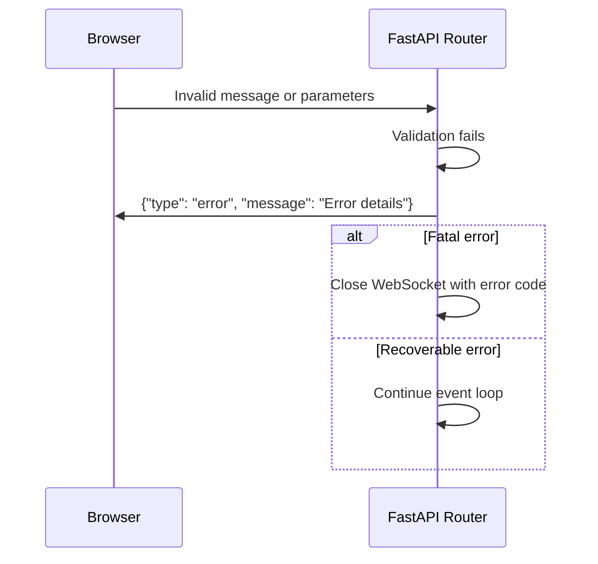

**Error message format:**
```json
{"type": "error", "message": "Error description"}
```

Common error scenarios:
- Invalid protocol version
- Invalid parameters for plot initialization
- Invalid parameters for update
- Unknown save format
- Validation errors
- Protocol version missing or incompatible
- Wrong message type as first client message

---

## Message Queue Behavior

**Important:** The message queue is drained after MOST client messages are processed, with one exception:

1. **`draw`**: Sends complete response inline (image_mode + binary PNG), then continues to next message

**Protocol handshake is outside the event loop:** The protocol_version exchange happens before entering the main event loop, so it doesn't use the queue mechanism.

```python
# In router.py:

# Protocol handshake (before event loop):
# 1. Send server protocol_version
# 2. Wait for client protocol_version
# 3. Validate and send all configuration messages

# Event loop:
while True:
    data = await websocket.receive_json()
    
    # draw handler:
    if data["type"] == "draw":
        # ... render image ...
        await websocket.send_json({"type": "image_mode", ...})
        await websocket.send_bytes(image_data)
        continue  # Skip drain_queue

    # All other handlers:
    else:
        await handler(data, websocket)
        await canvas.drain_queue(websocket)  # Always called for other messages
```

This means:
1. Protocol handshake completes before entering event loop
2. Toolbar can queue messages at any time during event handlers
3. Those messages will be sent after the next client message is processed (except draw)
4. Tests must account for variable message sequences
4. Client should be prepared to receive queued messages after most requests
4. Client should be prepared to receive queued messages after most requests
